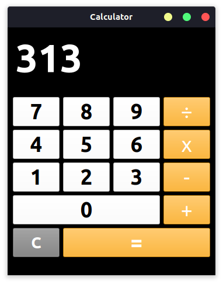

# Calculator

Calculator with 🐍 Python3 🌱 PySide6 

<div align="center">



</div>

## Clone from GitHub
```bash
git clone https://github.com/msfpt/calculator
```

<br>

## Example

```bash
python3 -m pip install PySide6
```

```bash
python3 calculator
```
